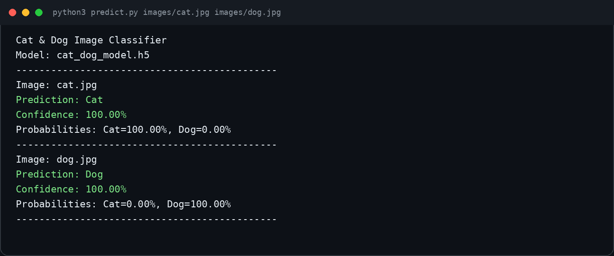

# Cat & Dog Image Classifier | مصنف صور القطط والكلاب

مشروع تعرّف على الصور يميز بين فئتي **Cat** و**Dog** باستخدام نموذج صُدّر من Google Teachable Machine بصيغة Keras، مع سكربت Python مستقل للتنبؤ والتقييم.

An image-recognition project that distinguishes **Cat** from **Dog** using a Google Teachable Machine model exported in Keras format, with standalone Python scripts for prediction and evaluation.

**إعداد: ناصر الشريف — Nasser Al-Sharif**

## فكرة المشروع | Project Idea

تم إنشاء فئتين في Teachable Machine باسم `Cat` و`Dog`، وإضافة الصورتين الأصليتين، وتدريب النموذج، ثم تصديره من `TensorFlow → Keras` كملف `keras_model.h5` مع ملف `labels.txt`.

Two classes named `Cat` and `Dog` were created in Teachable Machine. The supplied source images were added, the model was trained, and it was exported through `TensorFlow → Keras` as `keras_model.h5` with `labels.txt`.

أظهر التقييم الأولي أن صورة واحدة لكل فئة لا تكفي؛ لذلك تم إنشاء 60 تنويعًا لكل صورة بالتدوير والقص والسطوع والتباين والانعكاس، ثم أُعيد تدريب طبقة التصنيف مع تجميد مستخرج الخصائص القادم من Teachable Machine.

The initial evaluation showed that one image per class was insufficient. Therefore, 60 deterministic variations of each image were generated using rotation, crop, brightness, contrast, and flipping, then the classification head was fine-tuned while the Teachable Machine feature extractor remained frozen.

## النتائج | Results

| المقياس / Metric | النتيجة / Result |
|---|---:|
| فئات التصنيف / Classes | Cat, Dog |
| عينات التدريب / Training samples | 96 |
| عينات التحقق المحجوزة / Held-out validation samples | 24 |
| دقة التحقق / Validation accuracy | 100% |
| مصفوفة الالتباس / Confusion matrix | `[[12, 0], [0, 12]]` |
| اختبار الصورتين الأصليتين / Original-image test | 2/2 correct |

ترتيب مصفوفة الالتباس هو: الصفوف تمثل الفئة الحقيقية، والأعمدة تمثل الفئة المتوقعة، بالترتيب `Cat` ثم `Dog`.

The confusion-matrix rows are actual classes and columns are predicted classes, ordered as `Cat` then `Dog`.

> ملاحظة علمية: جميع العينات مشتقة من صورتين أصليتين فقط؛ لذلك النتيجة تقيس أداء النموذج على تنويعات هاتين الصورتين، ولا تثبت قدرته على التعميم على كل صور القطط والكلاب.
>
> Scientific note: every sample is derived from only two source images. The result measures performance on variations of these images and does not prove broad real-world generalization.

## لقطة المخرجات | Output Screenshot



## هيكلة المشروع | Project Structure

```text
Cat_Dog_Image_Classifier/
├── images/
│   ├── cat.jpg
│   └── dog.jpg
├── model/
│   ├── keras_model.h5       # Original Teachable Machine export
│   ├── cat_dog_model.h5     # Fine-tuned final model
│   └── labels.txt
├── screenshots/
│   └── prediction_output.png
├── predict.py
├── train_model.py
├── generate_training_samples.py
├── create_output_screenshot.py
├── evaluation_results.json
├── prediction_output.txt
├── requirements.txt
└── README.md
```

## التشغيل | Run the Project

أنشئ بيئة افتراضية وثبّت المتطلبات.

Create a virtual environment and install the dependencies.

```bash
python -m venv .venv
```

على Windows:

On Windows:

```powershell
.venv\Scripts\activate
pip install -r requirements.txt
```

على Linux أو macOS:

On Linux or macOS:

```bash
source .venv/bin/activate
pip install -r requirements.txt
```

اختبر النموذج على صورة واحدة أو عدة صور.

Test the model with one or more images.

```bash
python predict.py images/cat.jpg images/dog.jpg
```

لاختبار صورة جديدة:

To test a new image:

```bash
python predict.py path/to/new_image.jpg
```

## إعادة إنشاء التدريب | Reproduce the Training

أنشئ العينات المحسنة من الصورتين الأصليتين.

Generate augmented samples from the two source images.

```bash
python generate_training_samples.py --count 60
```

أعد تدريب طبقة التصنيف وقيّمها على عينات تحقق محجوزة.

Fine-tune the classifier head and evaluate it on held-out validation samples.

```bash
python train_model.py --epochs 25
```

أعد اختبار النموذج واحفظ المخرجات.

Run the final test and capture its output.

```bash
python predict.py images/cat.jpg images/dog.jpg > prediction_output.txt
python create_output_screenshot.py
```

## شرح المعالجة | Processing Pipeline

1. تُفتح الصورة وتُحوّل إلى RGB، ثم تُقص من المنتصف وتُضبط إلى `224 × 224` بكسل.
   The image is opened, converted to RGB, center-cropped, and resized to `224 × 224` pixels.
2. تُحوّل قيم البكسل من النطاق `[0, 255]` إلى `[-1, 1]` بما يطابق نموذج Teachable Machine.
   Pixel values are normalized from `[0, 255]` to `[-1, 1]`, matching Teachable Machine preprocessing.
3. يُحمّل نموذج Keras ويحسب احتمال كل فئة.
   The Keras model is loaded and calculates the probability of each class.
4. تُعرض الفئة صاحبة الاحتمال الأعلى مع نسبة الثقة وجميع الاحتمالات.
   The highest-probability class is shown with its confidence and all class probabilities.

## ملفات النموذج | Model Files

- `model/keras_model.h5`: التصدير الأصلي من Teachable Machine.
  `model/keras_model.h5`: the original Teachable Machine export.
- `model/cat_dog_model.h5`: النموذج النهائي بعد تحسين طبقة التصنيف.
  `model/cat_dog_model.h5`: the final model after classifier-head fine-tuning.
- `model/labels.txt`: ترتيب أسماء الفئات في خرج النموذج.
  `model/labels.txt`: the class-name order used by the model output.

يستخدم المشروع `tf-keras` المتوافق مع ملفات HDF5 القديمة التي يصدرها Teachable Machine.

The project uses `tf-keras`, which remains compatible with the legacy HDF5 files exported by Teachable Machine.

## متطلبات المهمة | Task Checklist

- [x] استخدام فئتين على الأقل وتدريب نموذج للتعرف على الصور.
  Use at least two classes and train an image-recognition model.
- [x] تصدير ملفات النموذج بصيغة TensorFlow/Keras.
  Export the model files in TensorFlow/Keras format.
- [x] كتابة سكربت Python يحمّل النموذج ويستقبل صورة ويتوقع فئتها.
  Write a Python script that loads the model, accepts an image, and predicts its class.
- [x] تقييم النموذج وحفظ النتائج في `evaluation_results.json`.
  Evaluate the model and save the results in `evaluation_results.json`.
- [x] إرفاق سكربت Python وملفات النموذج ولقطة للمخرجات.
  Include the Python script, exported model files, and an output screenshot.

## رفع المشروع إلى GitHub | Upload to GitHub

```bash
git init
git add .
git commit -m "Add Cat and Dog image classifier"
git branch -M main
git remote add origin https://github.com/YOUR_USERNAME/Cat_Dog_Image_Classifier.git
git push -u origin main
```

## الترخيص | License

هذا المشروع متاح بموجب ترخيص MIT.

This project is available under the MIT License.
